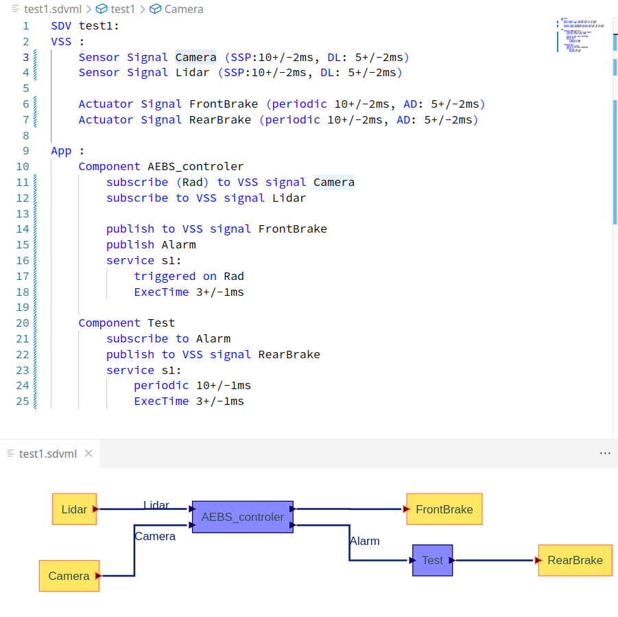

# SoftwareDefinedVehicleModelingLanguage
a simple DSL for SDV understandable timing Analysis

to build: call yarn at the [root folder](../../)

Then run the extension (`F5` on a `.ts` file and extension development environment is asked)

The grammar can be found [here](./src/sdvml.langium)

Some minimal examples can be found under the [workspace](../workspace/) folder. You can compile them by launchin the CLI which is in the [bin](bin) folder like this (considering you're in the demo folder)

    node ../packages/language-server/bin/cli.js generate test1.sdvml
*warning: some paths have been changed and should maybe be updated.*

It will compiled a network of communicating timed automata in the IF folder.

